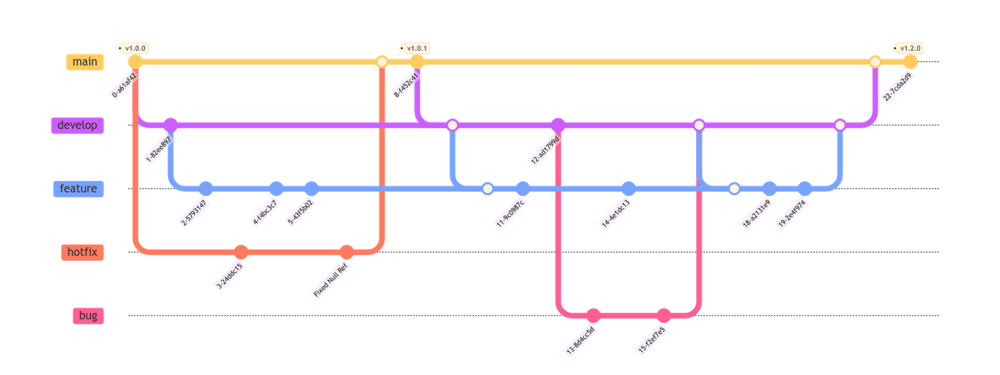

# **WaveDiff Development Plan**

## 1.  **Define a Milestone**
    

  * **Purpose**: Milestones mark the completion of project cycles and achievement of predefined goals. A milestone is a timeline point marking the end of a project cycle, where a set of goals defined at the start of the cycle have been completed.  Goals could be tasks associated with feature development, testing phase completion, etc. List & Open issues. 
    
  * **Types of Milestones:** Differentiate between major, minor and patch release releases to track progress effectively.
    

Make a milestone related to a release on possibly a minor release schedule (e.g. monthly schedule). Differentiate between the different types of releases (minor, major, patch).

## 2.  **Git Workflow Branching Model (Made with** [**mermaid**](https://mermaid.js.org)**)**

   *   **main**: Stores official release history with tagged version numbers (see top row in the diagram above).
    
   *   **develop**: This branch is the integration branch for features.
    
   *   **feature**: Branch off of develop for new feature development.  Features get merged to develop (never to main).
    
   *   **bug**: For fixing specific bugs introduced during the production phase.
    
   *   **hotfix**: Quickly corrects bugs in the latest release version; branched off main.
    

## 3.  **New Branch naming conventions**
    

Branches created for the purpose of a Pull Request should be directly related to an open issue within the project’s issue tracker.  This ensures that all code changes are tied to specific tasks or features, facilitating better organisation and tracking of contributions.Below are the branch naming conventions:

   *   **Feature**: feature/issue-/short-description
    
   *   **Bug**: bug/issue-/short-description
    
   *   **Hotfix**: hotfix/issue-/short-description
    

Replace with the corresponding issue number and provide a brief description of the changes in \`short\_description\`.

## 4.  **Feature branch creation** 
    

*   Pull the latest changes from the remote repository
    
*   Checkout develop
    
*   Create a new feature branch
    
*   Ensure the feature branch’s commits align with the defined scope
    

**Tip**: Keep feature branch development focused on the defined scope outlined in the corresponding issue. Avoid introducing unrelated changes. Instead, open a new issue for out-of-scope features or bugs, creating a separate branch for their development.

## 5.  **Completion of development** 
    

*   Run training and metrics validation tests locally to confirm no breaking behaviour or errors were introduced.  Include test reports as per the PR template.
    
*   Open a Pull Request to start the review process, ensuring to map the branch correctly to the target branch (i.e. feature\_branch -> develop or hotfix\_branch -> main).
    
*   In the description of the Pull Request, explicitly state whether the PR resolves or closes an open issue by using one of the following formats:
    
    *   "Solves #"
        
    *   "Closes #"
        

Example: "Solves #12345" or "Closes #8679".

*   Ensure that the PR meets the defined requirements and passes Continuous Integration (CI) tests.
    
*   Assign a reviewer, assign yourself as assignee, select the correct project, choose the correct label that describes the nature of the issue (e.g. bug, enhancement, etc), choose Milestone if applicable if the issue is associated with a specific milestone or target release.
    
*   Address reviewer feedback in threads and iterate as needed, implementing the requested changes or explaining why the task is implemented in the manner it is.  Respect the rule: Whoever opens the thread/conversation in the Pull Request is responsible for closing it.
    

## 6.  **Merging Pull Requests** 
    

*   Approval and Merging: Once the reviewer approves the PR and all feedback is addressed, merge the feature branch into develop.  Note, it is the reviewer who is responsible for merging the PR when satisfied with the changes.
    

## 7.  **Preparing for a Release**
    

*   Each milestone targets a release (feature, patch, etc).
    
*   Open a PR from develop to main upon completing a milestone
    
*   Ensure all checklist items for the release are completed.
    
*   Merge the PR into main and tag the release.
    

## 8.  **Continuous Improvement**
    

*   Regularly review and refine the workflow based on team feedback and lessons learned.
    
*   Encourage collaboration and communication among team members to streamline processes and enhance productivity.
    

## 9.  **Documentation and Training**
    

*   Maintain up-to-date documentation outlining the development workflow and procedures.
    
*   Provide training to new team members and ensure existing members are familiar with the workflow and best practices.
    

## 10.  **Automation and Tooling**
    

*   Explore automation tools to streamline repetitive tasks, such as testing, code formatting, and deployment.
    
*   Integrate with CI/CD pipelines for automated testing and deployment processes.
    
